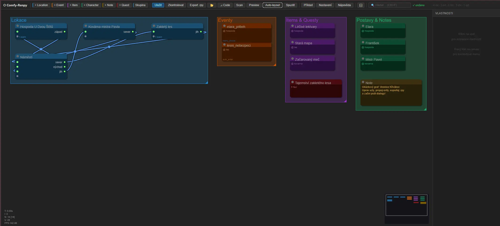

# ⬡ Comfy-Renpy

Vizuální node-based editor pro návrh struktury [Ren'Py](https://www.renpy.org/) her — inspirovaný [ComfyUI](https://github.com/comfyanonymous/ComfyUI).

Navrhuješ místnosti, propojuješ je exity, přidáváš eventy, itemy a postavy. Editor pak vygeneruje `.rpy` kostru, do které dopíšeš dialogy. Opakovaný export zachová vše, co jsi napsal.



## Funkce

- **Grafický editor** místností a jejich propojení (LiteGraph.js)
- **6 typů uzlů**: Location, Event, Item, Character, Note, Quest
- **Obousměrné exity** — kabel ↔ se vykreslí jako dvojitá teal čára, reverzní exit se vygeneruje při exportu
- **Validace** grafu před exportem (duplicitní ID, chybějící vazby)
- **Export do .rpy** — generuje stub soubory s `[COMFY-START/END]` markery
- **Preview** — náhled vygenerovaného `.rpy` bez zápisu na disk
- **Round-trip bezpečný** — re-export přepíše jen strukturu, tvůj dialog zůstane
- **Scan** — zobrazí stav každého uzlu (written / stub / missing / drift)
- **Auto-layout** — rozmístí uzly do sekcí a automaticky vytvoří pojmenované skupiny
- **Compact mode** — přepínání toolbaru mezi ikonkami a textovými popisky (⊟/⊞)
- **Auto-save** grafu každé 2 sekundy
- **TypeScript + Vite** frontend s plnou typovou kontrolou

## Rychlý start

```bash
git clone https://github.com/Bumprdlik/comfy-renpy
cd comfy-renpy
npm install

# Vývoj — Express :3001 + Vite dev server :5173
npm run dev
# → otevři http://localhost:5173

# Produkce
npm run build   # sestaví frontend do dist/
npm start       # Express :3001 servíruje dist/
# → otevři http://localhost:3001
```

## Konfigurace

Klikni na **⚙ Nastavení** v toolbaru a nastav:

| Pole | Popis |
|---|---|
| **gameDir** | Cesta k `game/` adresáři tvého Ren'Py projektu. Export ukládá soubory sem. |
| **renpyExe** | Cesta k `renpy.exe` — potřebné pro tlačítko ▶ Spustit. |

Nastavení se uloží do `.comfy.json` vedle `server.js` (není verzováno).

Alternativně vytvoř `.comfy.json` ručně podle `.comfy.example.json`:

```json
{
  "port": 3001,
  "gameDir": "C:/mygame/game",
  "renpyExe": "C:/renpy/renpy.exe"
}
```

## Typy uzlů

### Location
Místnost v herním světě. Pojmenované **exity** (výstupní porty) propojuješ šipkami do jiných místností — tím vzniká mapa hry.

### Event
Událost/scéna vázaná na lokaci. Nastavíš trigger (`auto_enter`, `menu_choice`, `condition`), prerekvizitu (Python výraz), čas dne a prioritu.

### Item
Předmět v herním světě. Slouží jako vizuální poznámka — lze ho propojit s eventem jako prerekvizitu.

### Character
Postava s hlasem/stylem (pro AI generování dialogů) a sprite ID.

### Note
Volná textová poznámka přímo na canvasu. Exportem ani scanem není dotčena.

### Quest
Quest / úkol s fázemi. Generuje `.rpy` do `{gameDir}/quests/` s proměnnými `{id}_active` a `{id}_stage` pro sledování postupu hráče.

## Export a round-trip

Tlačítko **Export .rpy** nejprve validuje graf. Pokud jsou nalezeny chyby nebo varování, zobrazí se dialog — s varováními lze exportovat přesto.

Soubory jdou do `{gameDir}/locations/` a `{gameDir}/events/`.

Každý soubor má strukturu:

```renpy
# [COMFY-START id=kitchen kind=header]
label location_kitchen:
# [COMFY-END]

    "Voní tu čerstvá káva."   ← tvůj dialog — nikdy nepřepsán
    a "Dobré ráno."

# [COMFY-START id=kitchen kind=exits]
    menu:
        "north":
            jump location_hall
    jump location_kitchen
# [COMFY-END]
```

Opakovaný export přepíše **jen** bloky mezi markery. Vše ostatní zůstane nedotčeno.

## Scan

Tlačítko **Scan** zkontroluje stav každého uzlu a zobrazí barevný badge:

| Badge | Stav |
|---|---|
| 🟢 zelená | **written** — soubor má dialogový obsah |
| 🟡 žlutá | **stub** — soubor existuje, jen kostra |
| ⚫ šedá | **missing** — soubor ještě neexistuje |
| 🔴 červená | **drift** — soubor bez markeru nebo orphan |

## Klávesové zkratky

| Zkratka | Akce |
|---|---|
| `L` | přidat Location uzel |
| `E` | přidat Event uzel |
| `I` | přidat Item uzel |
| `C` | přidat Character uzel |
| `N` | přidat Note uzel |
| `Q` | přidat Quest uzel |
| `G` | přidat skupinu (LGraphGroup) |
| `Ctrl+F` | focusovat vyhledávací pole |
| `Pravý klik` na canvas | kontextové menu (Add Node) |
| `Del` / `Backspace` | smazat vybraný uzel nebo hranu |
| `Ctrl+Z` | undo |
| `Ctrl+C` / `V` | kopírovat / vložit uzly |
| `Escape` | zavřít modál |

## Licence

MIT
